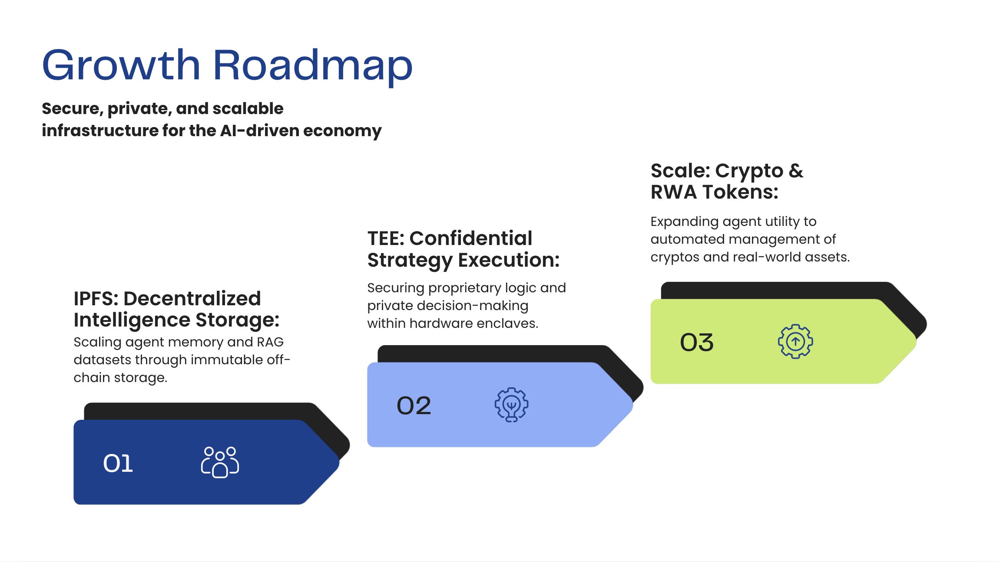

# Raw Bean Prompt: Monetizing Intelligence: The DeFi for AI Agent assets

Raw Bean Prompt is a modular platform that enables users to create, trade, and equip AI agent abilities as tokenized assets with bonding curve pricing on Base blockchain.

The system combines smart contracts, a web marketplace, and a Chrome extension to provide a seamless experience for trading AI-powered skills.

---

## 🏗️ System Architecture

### Smart Contracts (`packages/contracts/`)

#### Contract 1: `AbilityToken_BondingCurve.sol`

**Purpose:**  
ERC-20 token representing a specific AI ability/skill with built-in bonding curve pricing.

**Key Functions:**
- `buy(uint256 amount, uint256 deadline)`:  
  Purchase tokens at current bonding curve price. Price increases with supply.

- `sell(uint256 amount, uint256 deadline)`:  
  Sell tokens back to the contract at current bonding curve price. Price decreases with supply.

- `getCurrentBuyPrice()` / `getCurrentSellPrice()`:  
  Returns current price per token based on circulating supply.

**Economic Model:**
- **Bonding Curve Pricing**: Price automatically adjusts based on supply/demand
- **Base Price + Increment**: `price = basePrice + (circulatingSupply × priceIncrement)`
- **Instant Liquidity**: No need for traditional AMM pools
- **Creator Revenue**: Each trade generates fees for the token creator

**Security:**
- Deadline protection against front-running
- Slippage checks ensure fair pricing
- Non-transferable tokens prevent secondary market manipulation

---

#### Contract 2: `AbilityTokenFactory_BondingCurve.sol`

**Purpose:**  
Factory contract for deploying new ability tokens with standardized bonding curve mechanics.

**Key Functions:**
- `createAbilityToken(string name, string symbol, string prompt, string description, string category, uint256 basePrice, uint256 priceIncrement)`:  
  Deploys a new bonding curve token with custom parameters and metadata.

- `getAllAbilityTokens()`:  
  Returns array of all deployed token addresses for marketplace indexing.

- `getTokenInfo(address tokenAddress)`:  
  Retrieves full metadata including name, symbol, prompt, description, creator, supply, and pricing.

- `getCreatorTokens(address creator)`:  
  Lists all tokens created by a specific address.

**Scalability:**
- Unlimited token deployments without factory redeployment
- Each token is an independent contract with its own economics
- Event emissions enable off-chain indexing and analytics

**Event Structure:**
```solidity
event AbilityTokenCreated(
    address indexed tokenAddress,
    address indexed creator,
    string name,
    string symbol,
    string prompt,
    uint256 basePrice,
    uint256 priceIncrement,
    uint256 timestamp
);
```

---

### Web Application (`packages/web/`)

#### Technology Stack:
- **Framework**: Next.js 15 with App Router
- **Blockchain**: Wagmi + Viem + RainbowKit
- **Styling**: Tailwind CSS
- **AI Integration**: Google Generative AI (Gemini)
- **Animations**: Lottie (DotLottie React)

#### Key Pages:

**1. Marketplace (`app/page.tsx`)**
- Browse all available ability tokens
- Real-time pricing from bonding curves
- Buy/sell interface with ETH input
- Token details and metadata display
- Trading bot toggle for automated trading

**2. Launch (`app/launch/page.tsx`)**
- Create new ability tokens
- Configure bonding curve parameters (base price, price increment)
- Add AI prompt and description metadata
- One-click deployment to blockchain

**3. Dashboard (`app/dashboard/page.tsx`)**
- View owned tokens (creator + purchased)
- Portfolio statistics and balance tracking
- Token management interface
- Direct marketplace integration

**4. Agent (`app/agent/page.tsx`)**
- Drag-and-drop skill equipment system
- 3 skill slots for equipping abilities
- Execute AI analysis using equipped skills
- Lottie animations showing bot states
- Trading recommendations based on RobinPump analysis
- Thinking process visualization (12-second animation)

#### API Routes:

**`/api/analyze` (POST)**
- Accepts equipped skill prompts
- Calls Google AI (Gemini 2.5 Flash)
- Analyzes RobinPump.fun for highest market cap tokens
- Returns structured recommendations

**`/api/trade` (POST)**
- Executes buy transactions via ethers.js
- Handles contract interactions with gas estimation
- Returns transaction hash and event logs

**`/api/token-info` (POST)**
- Queries token metadata from factory contract
- Returns name, symbol, prompt, description, creator, supply, price

---

## 🔗 System Interaction Flow

### Token Creation Flow:
1. User connects wallet via RainbowKit
2. Fill out launch form with token details and bonding curve parameters
3. Frontend calls `createAbilityToken()` on Factory contract
4. New token deployed with unique address
5. Event emitted for indexing
6. Token appears in marketplace

### Trading Flow:
1. User browses marketplace and selects token
2. Input ETH amount for purchase
3. Frontend calculates token amount based on bonding curve
4. Call `buy()` on AbilityToken contract with ETH value
5. Tokens minted to user's wallet
6. Price automatically adjusted for next buyer

### AI Agent Execution Flow:
1. User drags skills from inventory to robot head (3 slots)
2. Click "Execute" button
3. Frontend shows thinking animation (12s with 4 phases)
4. API calls Google AI with equipped skill prompts
5. AI analyzes RobinPump.fun for high market cap tokens
6. Returns top 2 recommendations with scores
7. User can directly trade recommended tokens via modal

### Extension Agent Flow:
1. Extension monitors RobinPump.fun in background
2. Glowing text shows bot status
3. When opportunity detected, confirmation popup appears
4. User clicks "Confirm" or "Reject"
5. Approved trades execute via connected wallet

---

## 🔒 Security Features

**Smart Contract Security:**
- **Deadline Protection**: Prevents front-running on trades
- **Slippage Controls**: Automatic price verification
- **Access Control**: Only factory can deploy new tokens
- **Non-transferable**: Tokens bound to wallet to prevent secondary markets
- **Audited Patterns**: Uses OpenZeppelin standards

---

## 📊 Technical Specifications

**Blockchain:**
- Network: Base (Ethereum L2)
- Factory Address: `0x713b7F49F5700e24544710fe0dF868793ABFD8D5`
- Token Standard: ERC-20 with bonding curve extension

**AI Integration:**
- Model: Google Gemini 2.5 Flash
- Use Case: Market analysis, token recommendations
- Response Format: Structured JSON with scores and reasoning

---

## 🎨 Design Philosophy

**Zero-UI Agent Interface:**
- Minimal visual elements when agent is active
- Glowing text feedback for status updates
- Lottie animations for engaging feedback
- Confirmation required only for critical actions

**Bonding Curve Economics:**
- Fair price discovery through automated market making
- Early supporters benefit from lower prices
- Creator incentives through continuous revenue
- No liquidity fragmentation

**Modular Architecture:**
- Independent contracts for flexibility
- Reusable token standard
- Upgradeable web components
- Portable extension interface

---

## 🚀 Deployment

**Smart Contracts:**
```bash
cd packages/contracts
pnpm install
pnpm hardhat run scripts/deploy-bonding-curve.ts --network base
```

**Web Application:**
```bash
cd packages/web
pnpm install
pnpm run build
```

---

## Growth Roadmap

<div align="center">
  
</div>

### Phase 1: IPFS - Decentralized Intelligence Storage
**Scaling agent memory and RAG datasets through immutable off-chain storage.**

Implement IPFS integration to store:
- AI prompt libraries and training data
- Agent execution history and decision logs
- Large-scale RAG (Retrieval-Augmented Generation) datasets
- Immutable proof of agent capabilities and performance metrics

### Phase 2: TEE - Confidential Strategy Execution
**Securing proprietary logic and private decision-making within hardware enclaves.**

Deploy Trusted Execution Environments (TEE) for:
- Private AI model inference without exposing prompts
- Confidential trading strategies and execution logic
- Secure multi-party agent collaboration
- Zero-knowledge proof of agent performance

### Phase 3: Scale - Crypto & RWA Tokens
**Expanding agent utility to automated management of cryptos and real-world assets.**

Enable agents to manage:
- Multi-chain cryptocurrency portfolios
- DeFi protocol interactions (lending, staking, yield farming)
- Real-World Asset (RWA) tokens (real estate, commodities, securities)
- Automated rebalancing and risk management strategies

**Timeline:** Ongoing development in 2026 and beyond

---

## �🔗 Links

**Smart Contracts:**
- Factory (Bonding Curve): `0x713b7F49F5700e24544710fe0dF868793ABFD8D5`
- Block Explorer: [BaseScan](https://basescan.org/address/0x713b7F49F5700e24544710fe0dF868793ABFD8D5)

**Repositories:**
- GitHub: [Raw Bean Prompt](https://github.com/johnnyjclin/rawBeanPrompt)

**Deployment:**
- Web App: Coming soon
- Chrome Extension: Coming soon

---

## 📄 License

MIT License - See LICENSE file for details

---

## 👥 Team

Built with ❤️ by the Raw Bean Prompt team

---

**Note:** This project showcases the integration of AI, blockchain, and user experience design to create a new paradigm for trading AI-powered abilities as digital assets.
